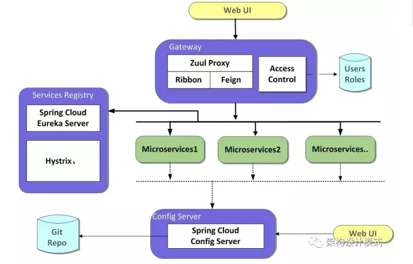
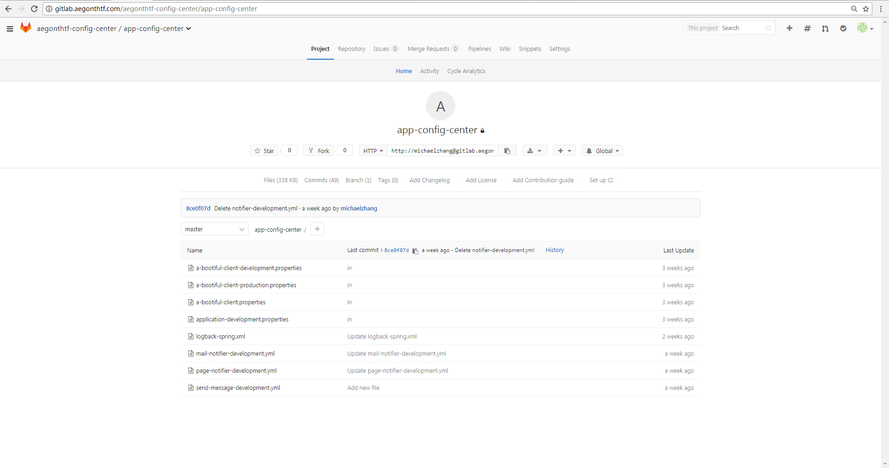
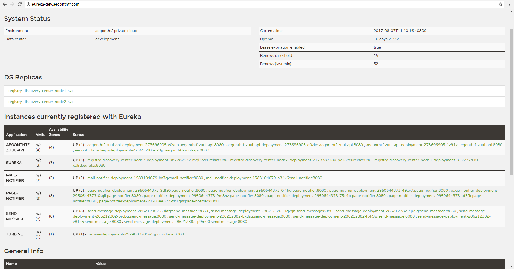
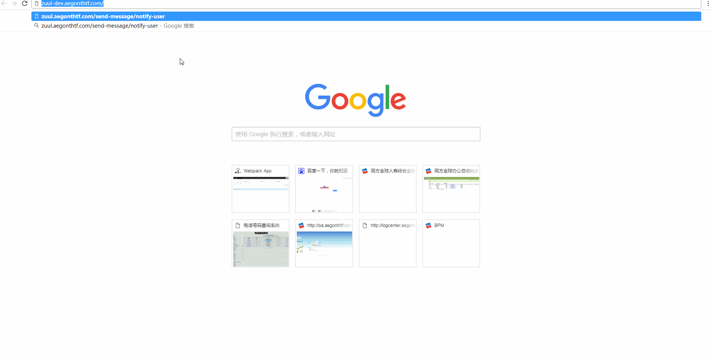
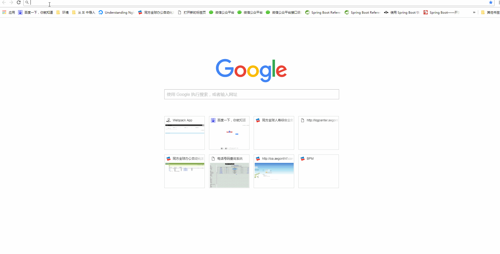

# Ocean容器云平台应用讨论

--------------------------------------------------------------------------------

## 讨论会议议题

1. 简要介绍Ocean容器平台的建设状况和架构
2. 讨论下一代业务系统平台给应用可能带来的便利和可能性
- 高密度使用资源，具备以可接受的成本支持分布式应用
- 通过计算和配置解耦，环境与应用的整体打包和流转两个方法，实现开发环境、测试环境、生产环境对应用计算实例的高度一致。 这一改进将解决目前发布流程中，测试验证和发布的脱离这一不足，确保发布的应用就是测试通过的版本丝毫不差。
- 日志信息的统一收集、保存、审计、分析
- 计算实例的灵活扩缩能力，控制管理应用的部署成本和承载能力。
- 应用更稳定，应用容器实例具备健康自我检测和故障自愈能力。
- 集成、部署更快速高效和自动化，有可能实现持续集成部署。
- 通过Maven和私有仓库的使用，使得对第三方jar包的依赖更清晰可管理
3. 实例演示、讨论
- 基于spring boot实例进行讨论，对比上述目标实现的情况
- 基于Spring Cloud的Demo实例讨论，了解和探讨Spring Cloud微服务架构在容器平台上的情况
4. 推介大家试用，共同雕琢完善我们的新一代系统平台-Ocean容器云平台。

## Ocean容器云平台架构概要介绍

容器平台组件：

seq | Component Name                   | URL Address
:-- | :------------------------------- | :---------------------------------------------------------------------------
1   | Jenkins                          | <http://jenkins-edge.aegonthtf.com>
2   | Gitlab                           | <http://gitlab.aegonthtf.com>
3   | LogCenter                        | <http://logcenter-dev.aegonthtf.com>
4   | Weave Scope Monitor              | <http://10.72.243.137:32358>
5   | Maven Private Repository         | <http://artifactory.aegonthtf.com>
6   | Harbor Registry                  | <http://registry.aegonthtf.com>
7   | SonarQube - Code Quality Control | <http://sonarqube-dev.aegonthtf.com>
8   | Promethues                       | <http://grafana.aegonthtf.com>
9   | K8s Dashboard                    | <http://k8s-dev-primary.aegonthtf.com> <http://k8s-dev-backup.aegonthtf.com>

## Demo案例演示和讨论：

> ## Spring Boot Demo演示和讨论

### 程序说明：

- 该Demo应用基于Spring Boot编写
- 使用Sprng Cloud Config Server中央配置中心保存配置项
- 日志使用logback框架，使用中央配置中心的统一配置，根据实际部署环境的不同自动激活不同的日志设置，程序日志输往集中日志中心
- 程序仅仅有简单的功能，显示两个配置项的内容
- Source Code保存在同方Gitlab上.
- Demo程序使用Maven作为构建工具，使用同方私有Artifactory Maven仓库。
- 使用持续集成部署Jenkins Pipeline部署至k8s容器平台。

### 演示步骤

- 创建应用项目Spring Boot Demo (查看代码、配置文件)
- Gitlab上创建仓库，将spring boot demo项目push到 Gitlab
- Demo应用的Jenkins Pipeline Item的配置
- 构建和部署

  -  构建、质量检查、部署发布（模拟测试环境）
  -  构建、质量检查、部署发布（模拟生产环境）

- 代码质量检查
     url: http://sonarqube-dev.aegonthtf.com
     查看和讨论

- 访问验证

  - 访问模拟测试环境<http://spring-boot-demo.aegonthtf.com/show>显示测试配置项内容
  - 访问模拟生产环境<http://spring-boot-demo-prod.aegonthtf.com/show>显示生产配置项内容
  - 分别在测试和生产日志平台上查看部署和访问产生的应用日志

    - <http://logcenter-dev.aegonthtf.com> Query String: application:"spring-boot-demo"
    - <http://logcenter.aegonthtf.com> Query String: application:"spring-boot-demo"

  - 通过查看域名转发的access日志了解应用的访问日志

    - <http://logcenter-dev.aegonthtf.com> QueryString: referrer:"<http://spring-boot-demo.aegonthtf.com/show>"

- 演示在线更改配置项并生效。
  - 更改配置项的值为一个新值
  配置项地址<http://gitlab.aegonthtf.com/aegonthtf-config-center/app-config-center/blob/master/spring-boot-demo-development.properties>
  -  postman中调用POST <http://spring-boot-demo.aegonthtf.com/refresh，> 触发新配置生效。
  - 访问<http://spring-boot-demo.aegonthtf.com/show查看，显示新配置项的值。>

  尚存在的问题： 多个实例的话，需要全部都要更新，配置项才全部生效。集群入口调一次只能改一个实例。

  其实配置中心这块有更好的实现，也有一些国内的开源产品在做，比如携程和百度都有，但因为更复杂没有做。都可以做到更改配置项后不用人工干涉，系统会自动对所有实例生效新的配置。

- 简单讨论Spring Actuator模块的作用。（基本不用动手就可以增加的应用运维心脏，健康监控探针）

  > actuator是spring boot提供的对应用系统的自省和监控的集成功能，可以对应用系统进行配置查看、相关功能统计等。

  - 访问<http://spring-boot-demo.aegonthtf.com/env> 查看运行环境
  - 访问<http://spring-boot-demo.aegonthtf.com/health> 查看应用健康状况。在目前的容器平台部署架构中用作监控探针，每个容器实例做自我监控，发觉自己病重会自杀，平台会重新生成一个

    HTTP方法 | 路径              | 描述            | 鉴权
    ------ | --------------- | ------------- | -----
    GET    | http://spring-boot-demo.aegonthtf.com/autoconfig     | 查看自动配置的使用情况   | true
    GET    | http://spring-boot-demo.aegonthtf.com/configprops    | 查看配置属性，包括默认配置 | true
    GET    | http://spring-boot-demo.aegonthtf.com/beans          | 查看bean及其关系列表  | true
    GET    | http://spring-boot-demo.aegonthtf.com/dump           | 打印线程栈         | true
    GET    | http://spring-boot-demo.aegonthtf.com/env            | 查看所有环境变量      | true
    GET    | /env/{name}     | 查看具体变量值       | true
    GET    | http://spring-boot-demo.aegonthtf.com/health         | 查看应用健康指标      | false
    GET    | http://spring-boot-demo.aegonthtf.com/info           | 查看应用信息        | false
    GET    | http://spring-boot-demo.aegonthtf.com/mappings       | 查看所有url映射     | true
    GET    | http://spring-boot-demo.aegonthtf.com/metrics        | 查看应用基本指标      | true
    GET    | /metrics/{name} | 查看具体指标        | true
    POST   | /shutdown       | 关闭应用          | true
    GET    | http://spring-boot-demo.aegonthtf.com/trace          | 查看基本追踪信息      | true

- 演示一下在容器平台上灵活扩展／缩小应用实例数目达到灵活改变处理能力的操作。

- 简单演示Promethues/WeaveScope监控Redis以及k8s Platform的情况。
  URL： http://grafana.aegonthtf.com

- 讨论。 

  > ## Spring Cloud

Spring Cloud各组件地址：

Seq | Component Name                | URL Address
:-- | :---------------------------- | :--------------------------------
1   | Spring Cloud Config Center    | <http://earthcore.aegonthtf.com>
2   | Spring Cloud Eureka Center    | <http://eureka-dev.aegonthtf.com>
3   | Spring Cloud ZipKin           | <http://zipkin-dev.aegonthtf.com>
4   | Spring Cloud Turbine          | <http://turbine.aegonthtf.com>
5   | Spring Cloud Zuul API Gateway | <http://zuul.aegonthtf.com>

## Spring Cloud Demo 演示和讨论

演示Case：

基于Spring Cloud框架开发三个服务，1\. Send Message 2\. Mail Notifier 3\. Page Notifier 三个服务均注册在服务注册中心，每个服务至少有两个以上的实例，每个实例的配置信息均保存在配置中心。三个服务均以Zuul API的方式暴露服务。 三个服务没有任何功能，仅仅是记录日志。 Send Message分别调用Mail Notifier和Page Notifier模拟通过两种方式发出通知的功能。 其中Page Notifier每次被调用会消耗4s的时间，Mail Notifier会立即返回。

1. 介绍、演示、讨论Spring Cloud中的配置中心。

 

1. 介绍、演示、讨论Spring Cloud中的服务注册和发现中心。 
2. 介绍、演示、讨论Spring Cloud中的服务跟踪。 
3. 介绍、演示、讨论Spring Cloud中的断路器及实时监控,Spring Cloud中的服务API网关
4. 介绍、演示、讨论利用Postman测试API 
5. 介绍、演示、讨论Apache Jemeter针对API进行压力测试。 
