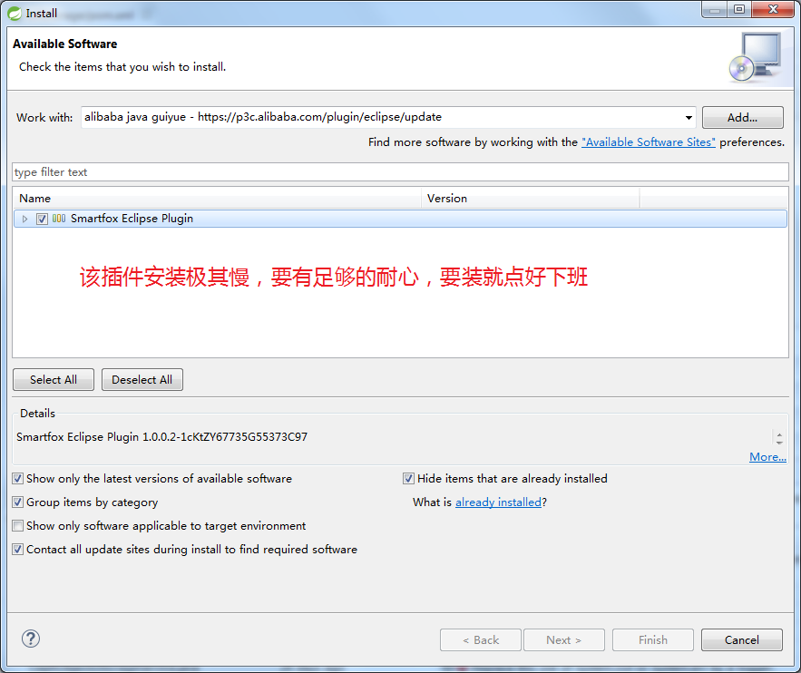
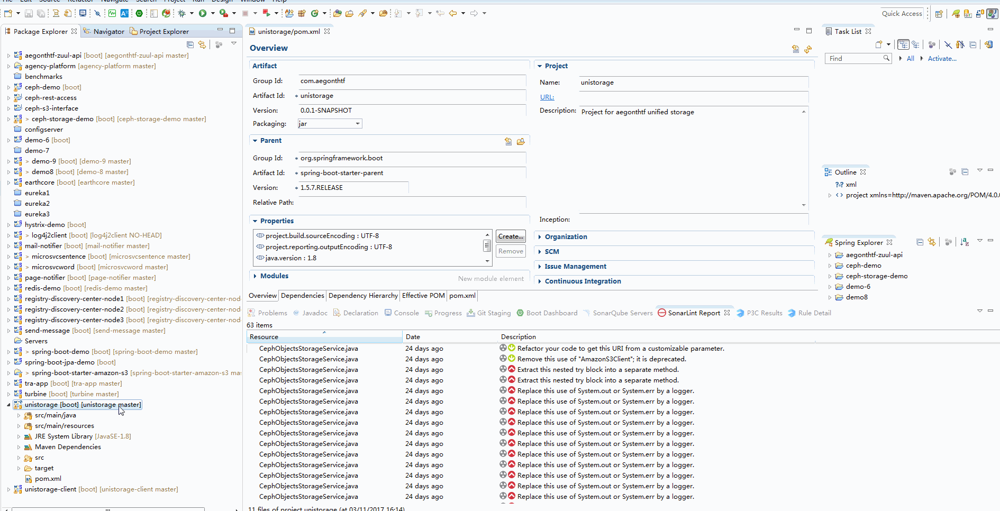

# 代码质量检查和分析指南


持续集成部署中包含代码质量检查一个环节，有工具协助进行代码规范和质量检查，应该是可以协助开发人员提高代码质量，增加生产效能，避免一些缺陷和安全风险的，是一件有益的事情。所以借由持续集成部署的逐步推出，也希望将代码质量检查工具推荐给大家使用。 故有这篇笔记。

## 涉及工具
   1. SonarQube代码质量扫描分析平台，eclipse插件
      试用地址：
      SonarQube URL: http://sonarqube-dev.aegonthtf.com  User: admin Password: admin
   2. 阿里Java代码规约插件（有兴趣可尝试）

## 使用场景
   1. 开发过程中检查分析代码质量，确保产出代码的质量
   2. 部署过程中分析检查代码质量，并增加检查标准和阀值，不符合质量要求的代码不允许部署到UAT环境和生产环境
   3. 调阅代码质量检查的数据，编写QA质量检查报告


## 开发过程中如何使用


* #### 在eclipse中使用Maven（调用sonarqube scannner)分析项目代码质量

SonarQube Scanner，是sonarqube是SonarQube的客户端,是代码扫描的工具，它会将项目的代码进行分析并与sonarqube Server一起完成代码分析，最后将结果发送至SonarQube服务器。

SonarQube Scanner很方便和不同类型的构建工具进行整合，我们使用Maven。

Maven仓库中有SonarQube Scanner工具的插件，只需要进行以下设置即可使用，需要在Maven的Setting.conf文件进行如下配置（我的配置，该配置指定了本地Maven仓库，并设置完毕sonarqube相关信息）
````xml
<?xml version="1.0" encoding="UTF-8"?>
<settings xsi:schemaLocation="http://maven.apache.org/SETTINGS/1.1.0http://maven.apache.org/xsd/settings-1.1.0.xsd";; xmlns="http://maven.apache.org/SETTINGS/1.1.0";;
    xmlns:xsi="http://www.w3.org/2001/XMLSchema-instance">;;

  <pluginGroups>
    <pluginGroup>org.sonarsource.scanner.maven</pluginGroup>
  </pluginGroups>

  <profiles>
    <profile>
        <id>sonar</id>
        <activation>
            <activeByDefault>true</activeByDefault>
        </activation>
        <properties>
            <!-- Optional URL to server. Default value is http://localhost:9000 -->
            <sonar.host.url>
                 http://sonarqube-dev.aegonthtf.com
            </sonar.host.url>
        </properties>
     </profile>

    <profile>
      <repositories>
        <repository>
          <snapshots>
            <enabled>false</enabled>
          </snapshots>
          <id>central</id>
          <name>libs-release</name>
          <url>http://artifactory.aegonthtf.com/artifactory/libs-release</url>;;
        </repository>
        <repository>
          <snapshots />
          <id>snapshots</id>
          <name>libs-snapshot</name>
          <url>http://artifactory.aegonthtf.com/artifactory/libs-snapshot</url>;;
        </repository>
      </repositories>
      <pluginRepositories>
        <pluginRepository>
          <snapshots>
            <enabled>false</enabled>
          </snapshots>
          <id>central</id>
          <name>plugins-release</name>
          <url>http://artifactory.aegonthtf.com/artifactory/plugins-release</url>;;
        </pluginRepository>
        <pluginRepository>
          <snapshots />
          <id>snapshots</id>
          <name>plugins-snapshot</name>
          <url>http://artifactory.aegonthtf.com/artifactory/plugins-snapshot</url>;;
        </pluginRepository>
      </pluginRepositories>
      <id>artifactory</id>
    </profile>
  </profiles>
  <activeProfiles>
    <activeProfile>artifactory</activeProfile>
  </activeProfiles>
</settings>

````
配置完成后，在项目中，执行mvn sonar:sonar，SonarQube Scanner会完成扫描，并扫描结果会上传至Sonarqube服务器中，登陆服务器中就可以查看分析结果和进行后续处理了。

执行示例：
   Demo项目： unistorage
   开发工具：  Eclipse
   Build工具： Maven

   演示示例：  通过开发工具中调用maven sonar:sonar完成代码分析，并在sonarqube服务端查看分析结果
   

   演示示例：  通过持续集成部署流程完成代码分析. 特别点在代码质量检查的地方有两个步骤，一个是扫描分析，一个是评分。 评分低于标准，则流程终止，即无法完成部署。 这也是一个关键点，也许未来我们会用，那样不符合标准的程序就无法发到平台上去了。

   


* ####  SonarLint (eclipse plugin)组件的安装和使用

SonarLint可以在开发工具中实时对代码进行分析，并可以与sonarqube服务器联系。 试用过程发现sonarlint的分析结果并不会上传到sonarqube服务器中，但服务器中的策略等会影响sonarlint在本地的分析表现。
比如： 代码中存在一个已经被探知的bug,如果在服务器上标志已经修复，在下一次Sonarlint在分析时就会忽略这个bug.

   演示示例：  通过sonarlint完成本地分析.服务端标注一个bug,本地下次扫描是会按服务器策略展示结果。

   


https://www.sonarlint.org/eclipse/
http://www.jianshu.com/p/778fd35fd494

* #### 使用Sonarqube Scanner CLI进行代码扫描(作者未测试这个部分)

https://docs.sonarqube.org/display/SCAN/Analyzing+with+SonarQube+Scanner


* #### 阿里Java开发规约插件



使用演示：

   


* 参考资料：

1. https://jenkins.io/blog/2017/04/18/continuousdelivery-devops-sonarqube/

2. https://github.com/SonarSource/docker-sonarqube/blob/master/recipes.md?spm=5176.1972344.1.14.kcECvj&file=recipes.md

3. http://www.jumpbeandev.com/2017/01/03/sonarqube/

4. https://docs.sonarqube.org/display/SCAN/Analyzing+with+SonarQube+Scanner+for+Jenkins

5. https://github.com/felipebz/sonar-plsql
